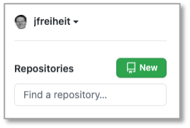
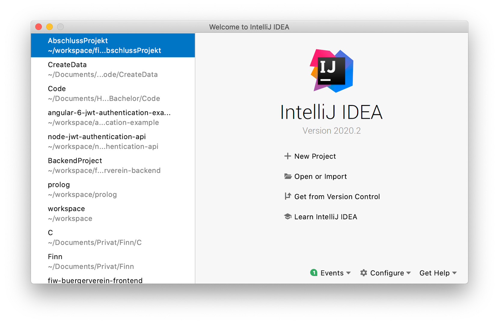
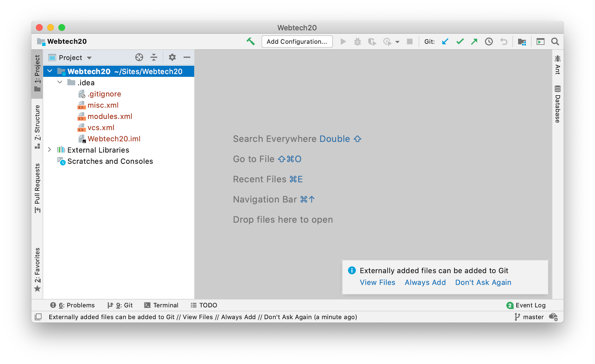
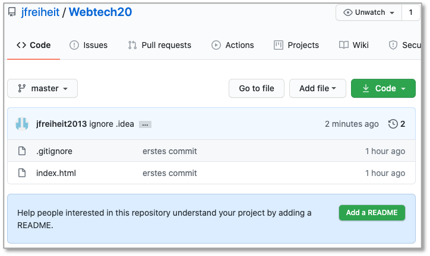
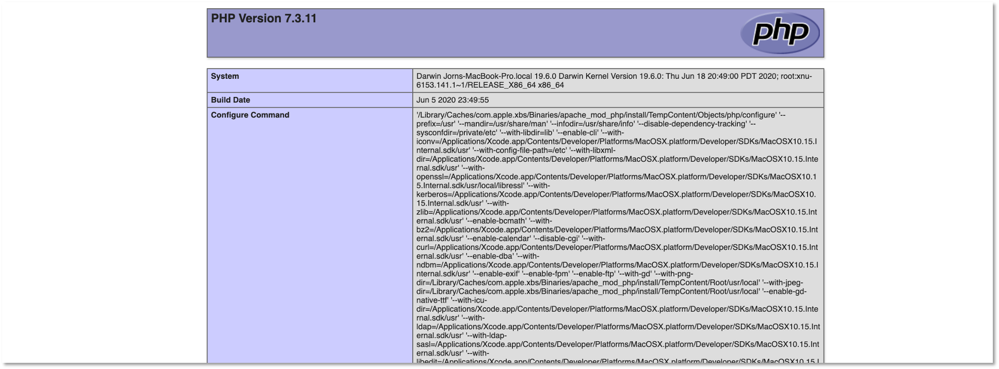
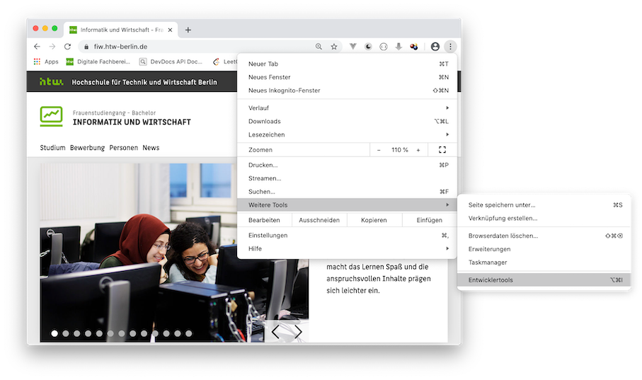
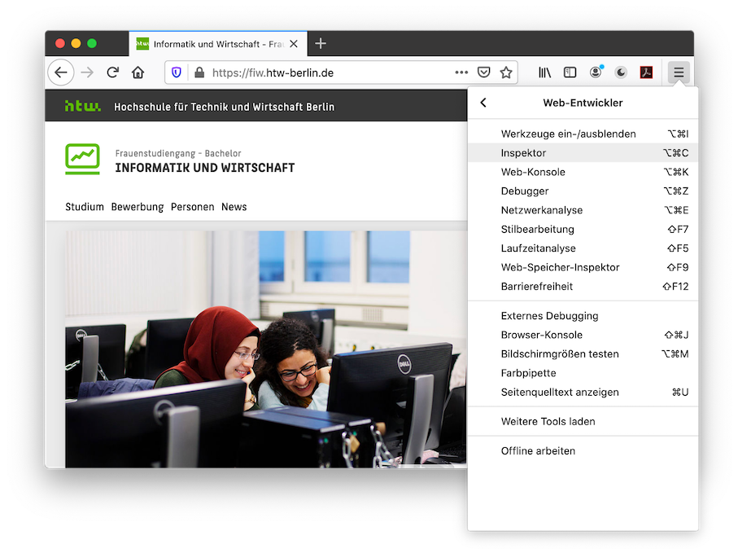
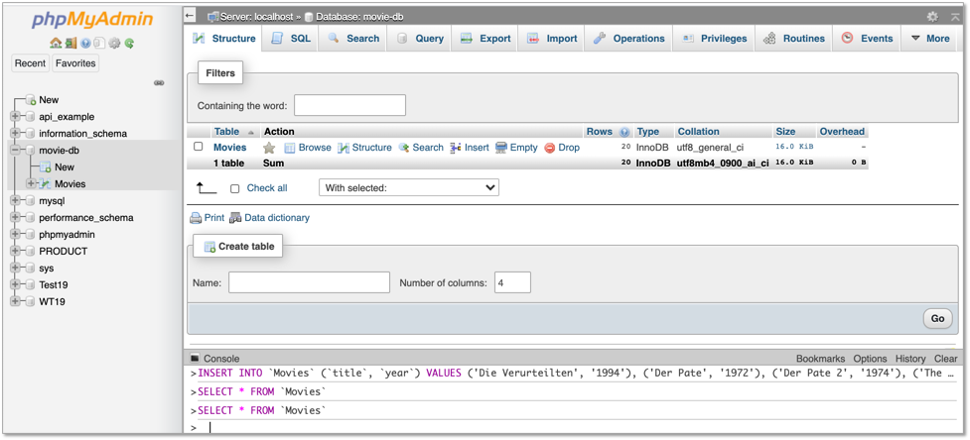

# Werkzeuge

## Integrated Development Environment (IDE)

Für die Webentwicklung stehen Ihnen viele gute Entwicklungswerkzeuge zur Verfügung. Für welches Sie sich entscheiden, bleibt Ihnen überlassen. Hier eine Auswahl der aus meiner Sicht besten Entwicklungswerkzeuge:

- [IntelliJ IDEA](https://www.jetbrains.com/de-de/idea/)
- [PhpStorm](https://www.jetbrains.com/de-de/phpstorm/)
- [WebStorm](https://www.jetbrains.com/de-de/webstorm/)
- [Sublime Text](https://www.sublimetext.com/)
- [Atom](https://atom.io/)
- [Visual Studio Code](https://code.visualstudio.com/)

Für die Tools von Jetbrains benötigen Sie einen Account. Mit Ihrer HTW-E-Mail-Adresse bekommen Sie aber eine kostenlose Hochschullizenz und können so die Enterprise-Versionen kostenlos nutzen. Sublime Text ist Shareware und fragt regelmäßig, ob Sie spenden möchten.  

Ich werde in den Vorlesungen und Übungen [Visual Studio Code](https://code.visualstudio.com/) verwenden. [Visual Studio Code](https://code.visualstudio.com/) ist auch auf den Laborrechnern verfügbar.

## Git

[**Git**](https://git-scm.com/) ist ein Werkzeug zur Versionskontrolle und zum gemeinsamen Entwickeln in Teams. Nach jeder Übung committen Sie Ihre Lösung und pushen Sie auf einen zentralen, netzbasierten Dienst, wie z.B.

- [GitHub](https://github.com/)
- [GitLab](https://about.gitlab.com/)
- [Bibucket](https://bitbucket.org/product/) 

Gewähren Sie mir Zugriff auf Ihr zentrales Repository. Auf GitHub finden Sie mich unter *jfreiheit* bzw. meiner E-Mail-Adresse *joern.freiheit@htw-berlin.de*.

### Repository initial anlegen

Wir zeigen das Erstellen eines Repositories exemplarisch für `GitHub`. ***Die Beispiele hier sind für das Jahr 2020, funktionieren aber noch genau so. Ersetzen Sie einfach  `20` durch `22`.***

#### Option A: Repository zunächst in Github anlegen, dann clonen

Als erstes loggen Sie sich in Github ein. Dort gibt es in der linken oberen Ecke einen Button `New`, siehe Bild:



Klicken Sie darauf und geben Sie die notwendigen Informationen ein (Beschreibung ist optional):


Sie können wählen, ob das Repository `Public` (für alle lesbar) oder `Private` (nur für Eingeladene lesbar) sein soll. Klicken Sie auf den Button `Create repository`. Kopieren Sie sich nun den Remote-Pfad in Ihre Zwischenablage, hier `https://github.com/jfreiheit/Webtech20.git`. 

Wechseln Sie nun lokal in Ihr `Terminal` und wechseln in Ihren Workspace Ihrer IDE. Ich wähle hier den Pfad `/Users/jornfreiheit/Sites`, da dieser Pfad gleichzeitig mein `DocumentRoot`ist, d.h., wenn ich `localhost` im Browser aufrufe, dann wird in diesem Pfad nach den Webseiten "gesucht". 

```bash
jornfreiheit@Jorns-MacBook-Pro Sites % pwd
/Users/jornfreiheit/Sites
``` 

Geben Sie dort nun ein: 

```bash
jornfreiheit@Jorns-MacBook-Pro Sites % git clone https://github.com/jfreiheit/Webtech20.git
Cloning into 'Webtech20'...
warning: You appear to have cloned an empty repository.
```

also `git clone` gefolgt von dem Remote-Pfad aus Ihrer Zwischenablage. Wenn Sie in Github weder `README.md` noch `.gitignore` ausgewählt hatten, dann erhalten Sie eine Warnung, dass Sie ein leeres Repository clonen. Das ist aber kein Problem. Sie können aber auch beide Datein in Ihr Repository integrieren, die `.gitignore`verwenden wir auf jeden Fall. In dem Ordner, in den Sie geclont haben, wird nun ein Ordner `Webtech20` angelegt. Diesen Ordner können Sie nun als Workspace Ihrer IDE verwenden. Also z.B. mit `IntelliJ IDEA`:



öffnen Sie das Projekt (`Open or import`) `Webtech20`. Es erscheint:



Hier können Sie wählen, dass neue Dateien immer automatisch zum Git-Repoitory hinzugefügt werden - das können Sie aber auch immer manuell machen (`git add .`). Angenommen, wir erstellen uns jetzt eine Datei `index.html` (`File --> New --> HTML File`) mit:

=== "index.html"
    ```html
    <!DOCTYPE html>
    <html lang="en">
    <head>
        <meta charset="UTF-8">
        <title>Erster Test</title>
    </head>
    <body>
    <h1>Willkommen</h1>
    <p>Das ist die Datei index.html. Sie liegt bei mir
        unter /Users/jornfreiheit/Sites/Webtech20.
        Der Ordner /Users/jornfreiheit/Sites ist mein
        DocumentRoot, deshalb kann ich diese Datei im Browser
        unter localhost/Webtech20/index.html aufrufen.
        Der Ordner Webtech20 wird von Git verwaltet. </p>
    </body>
    </html>
    ```

Da der Ordner `Sites` bei mir DocumentRoot ist und sich der `Webtech20`-Ordner (in dem die neue `index.html` ist) direkt darunter befindet, kann ich mir die Datei im Browser unter `localhost/Webtech20/index.html` anzeigen lassen. Das nat nichts mit Git zu tun, sondern mit dem DocumentRoot des lokalen Webservers.

Wir fügen im Terminal im `Webtech20`-Ordner diese Datei dem Git-Repoitory hinzu (falls noch nicht automatisch durch unsere IDE passiert):

```bash
jornfreiheit@Jorns-MacBook-Pro Webtech20 % git add index.html
jornfreiheit@Jorns-MacBook-Pro Webtech20 % git status
On branch master

No commits yet

Changes to be committed:
  (use "git rm --cached <file>..." to unstage)
  new file:   .idea/.gitignore
  new file:   .idea/Webtech20.iml
  new file:   .idea/misc.xml
  new file:   .idea/modules.xml
  new file:   .idea/vcs.xml
  new file:   index.html

jornfreiheit@Jorns-MacBook-Pro Webtech20 % 
```

Außerdem sollten wir den `.idea`-Ordner von der Git-Verwaltung ausschließen. Dazu erstellen wir im `Webtech20`-Ordner eine Datei `.gitignore`, falls diese noch nicht existiert und tragen dort `.idea` ein. Fügen Sie die Datei `.gitignore` Ihrem repository hinzu, führen Sie Ihr erstes Commit aus und pushen Ihr Repository nach Github:

```bash
git add .ignore
git commit -m "erstes commit"
git push
```

In Github erkenn Sie, dass commit und push geklappt haben:



In Zukunft fügen Sie Ihre neu erstellten Dateien und Ordner immer mit `git add .` hinzu, erstellen neue Commits mit `git commit -m "Commit-Nachricht"` und pushen dann nach Github mit `git push`. 


#### Option B: Repository in Github anlegen und lokal anlegen, dann verbinden

1. Legen Sie sich wie oben beschrieben ein Repository unter GitHub an. Kopieren Sie die *Remote-URL* (z.B. `https://github.com/jfreiheit/Webtech20.git`). 
2. Erstellen Sie sich lokal einen Ordner (am besten in Ihrem *DocumentRoot*), z.B. `Webtech20` (`mkdir Webtech20`). Wechseln Sie in diesen Ordner (`cd Webtech20`) und führen Sie dort `git init` aus. Es entsteht ein `.git`-Ordner. 
3. Fügen Sie diesem lokalen Repository alle Ihre bisher in `Webtech20` erstellten Dateien mit `git add .` hinzu. 
4. Erstellen Sie ein Commit, z.B. `git commit -m "initial commit"`.
5. Verbinden Sie Ihr lokales Repository mit dem remote-Repository auf Github durch `git remote add origin https://github.com/jfreiheit/Webtech20.git` (für `https://...` setzen Sie Ihre *Remote-URL* ein).
6. Pushen Sie die Dateien auf Ihr remote-Repository: `git push --set-upstream origin master`. 

In Zukunft fügen Sie Ihre neu erstellten Dateien und Ordner immer mit `git add .` hinzu, erstellen neue Commits mit `git commit -m "Commit-Nachricht"` und pushen dann nach Github mit `git push`. 

## Webserver

Für das Modul benötigen wir einen Webserver. Wir verwenden den [**Apache Webserver**](https://httpd.apache.org/ ). Auf dem Mac ist er bereits vorhanden, auf Linux-Systemen meistens auch. Für Windows-Systeme wird die Installation von [**XAMPP**](https://www.apachefriends.org/de/index.html ) empfohlen. Hier finden Sie Anleitungen zur Einrichtung des Webservers:

* Windows: 
    * [https://www.ionos.de/digitalguide/server/tools/xampp-tutorial-so-erstellen-sie-ihren-lokalen-testserver/](https://www.ionos.de/digitalguide/server/tools/xampp-tutorial-so-erstellen-sie-ihren-lokalen-testserver/ )
    * [https://werner-zenk.de/tipps/lokale_webserver_xampp.php](https://werner-zenk.de/tipps/lokale_webserver_xampp.php )
    * Wichtig ist, dass Sie wissen, wo sich Ihr *DocumentRoot* befindet (zunächst `xampp\htdocs` - lässt sich aber [ändern](https://www.seo-head.de/entwicklung/xampp-htdocs-verzeichnis-aendern/ ))
* Mac:
	* der Apache-Webserver ist bereits installiert
	* achten Sie darauf, dass Sie Ihr *DocumentRoot* kennen (meistens `Sites`, eventuell [**ändern**](https://sysadminde.com/questions/161529/how-to-change-document-root-for-apache2-in-mac-os-x))
* Linux:
    * die meisten Linux-Systeme haben bereits einen Webserver (auch hier wichtig, *DocumentRoot* zu kennen)
    * wenn nicht, können Sie sich auch [XAMPP](https://www.apachefriends.org/de/index.html ) installieren

Um zu testen, ob Ihr Webser läuft, erstellen Sie im *DocumentRoot* eine Datei `index.php` mit folgendem Inhalt:

```
<?php phpinfo(); ?>
```

und rufen in Ihrem Browser ``http://localhost/index.php`` auf. Es sollte eine ähnliche Ausgabe wie folgt erscheinen (nur Ausschnitt:




## Developer Tools

Alle Browser sind mit Werkzeugen ausgestattet, die es Web-Entwicklerinnen ermöglichen, im Browser Informationen über die Webanwendung zu erhalten. Für einige Browser ist hier angegeben, wie Sie diese Entwicklerwerkzeuge einschalten.

### Chrome

In Chrome sind die Entwicklerwerkzeuge unter dem Menü neben der URL-Eingabezeile unter `Weitere Tools --> Entwicklertools` verfügbar (siehe folgendes Bild).



Die eingeschalteten Entwicklertools offenbaren Ihnen umfassende Informationen über die angezeigte Webseite. Besonders interessant ist der Reiter `Console`:


oder auch der Reiter `Elements`, der Ihnen sowohl den HTML- als auch den jeweiligen CSS-Code anzeigt:


Weiterführende Informationen erhalten Sie unter [https://developers.google.com/web/tools/chrome-devtools](https://developers.google.com/web/tools/chrome-devtools).

### Firefox

Zu den Entwicklertools von Firefox finden Sie Informationen auf 

- [https://developer.mozilla.org/de/docs/Tools](https://developer.mozilla.org/de/docs/Tools)
- [Firefox Browser Developer](https://www.mozilla.org/en-US/firefox/developer/?utm_source=firebug&utm_medium=lp&utm_campaign=switch&utm_content=landingpage) 

Die Entwicklertools lassen sich in Firefox öffnen unter `Web-Entwickler --> Inspektor`:



Sie haben die gleichen Möglichkeiten der Ananlyse wie bei Chrome, bei Safari und anderen Browsern:


### Safari

In Safari müssen Sie zunächst den Menüeintrag `Entwickler` aktivieren. Eine Anleitung dazu finden Sie z.B. [hier auf heise](https://www.heise.de/tipps-tricks/Mac-Entwicklertools-in-Safari-aktivieren-4050163.html) . Weitere Informationen zu den Entwicklertools erhalten Sie z.B. auf

- [Werkzeuge im Menü „Entwickler“](https://support.apple.com/de-de/guide/safari/sfri20948/mac)
- [Safari Developer Help](https://support.apple.com/de-de/guide/safari-developer/welcome/mac)
- [Web Development Tools](https://developer.apple.com/safari/tools/)


## Curl

[Curl](https://curl.haxx.se/) ist ein Open-Source-Kommandozeilenprogramm, um Daten mittels URL zu transferieren. Curl kann auf der Kommandozeile genutzt werden, um SMTP, HTTP, FTP usw. zu verwenden. Wir werden Curl insbesondere für die HTTP-Anfragemethoden GET und POST verwenden. 

Eine ausführliche Beschreibung von Curl ist im Buch [Everything curl - the book](https://curl.haxx.se/book.html) frei verfügbar. Die Installation von Curl erfolgt über die [Curl Download Seite](https://curl.haxx.se/download.html).

Zum Testen, ob Curl korrekt funktioniert, können Sie im Terminal z.B.

``` bash
curl freiheit.f4.htw-berlin.de/curl.html
```

eingeben. Es sollte folgende Ausgabe erscheinen:

```bash
<!DOCTYPE html>
<html>
  <head>
    <title>Curl-Test</title>
  </head>
  <body>
    <p>Hallo FIW!</p>
  </body>
</html>
```

Mit dem `-o`-Flag können Sie die Datei speichern (Sie können einen Dateinamen angeben - hier `curl.html`):

```bash
curl -o curl.html freiheit.f4.htw-berlin.de/curl.html
``` 

Da oben die lokale Datei genau so heißt wie die remote-Datei, hätte man auch 

```bash
curl -O freiheit.f4.htw-berlin.de/curl.html
``` 

angeben können, also großes `-O`. Mit dem `-d`-Flag können Parameter übergeben und die entsprechende Seite mit einer POST-Anfrage aufgerufen werden. Mit dem zusätzlichen `-G`-Flag erfolgt die Anfrage nicht als POST sondern als GET. Mit dem `-I`-Flag fragen Sie den Header der Anfrage ab, z.B.:

```bash
curl -I freiheit.f4.htw-berlin.de/curl.html
``` 

gibt etwas aus in der Art:

```bash
HTTP/1.1 200 OK
Date: Thu, 04 Jun 2020 13:59:43 GMT
Server: Apache/2.4.38 (Debian)
Last-Modified: Thu, 04 Jun 2020 13:01:59 GMT
ETag: "78-5a741c004bdb9"
Accept-Ranges: bytes
Content-Length: 120
Vary: Accept-Encoding
Content-Type: text/html

``` 

Für eine vollständige Übersicht aller Flags von Curl siehe [Curl manpage](https://curl.haxx.se/docs/manpage.html).

## Postman

Postman ist eine Anwendung, um Schnittstellen (*Application Programming Interface - API*), die das Backend bereitstellt, zu entwickeln und zu testen. Sie finden Postman unter [postman.com](https://www.postman.com/). Wir beschränken uns zunächst auf den [Postman API Client](https://www.postman.com/product/api-client/). Laden Sie das Tool herunter und installieren es. Rufen Sie Postman auf und geben in das Eingabefeld `https://postman-echo.com/get` ein. Lassen Sie die Auswahl links daneben auf `GET` und klicken auf den `Send`-Button. Es erscheint folgendes Bild:


Neben der `GET`-Anfrage sind folgende weitere Anfragen (siehe auch [**HTML --> HTTP**](./html/#http)) möglich:

- `POST` - sendet Daten zur Verarbeitung an den Webserver
- `PUT` - lädt existierende Daten (eine Datei) auf den Server
- `PATCH` - ändert Daten (eine Datei), ohne - wie bei `PUT` - diese vollständig zu ersetzen
- `DELETE` - löscht die angegebenen Daten auf dem Server

## Node.js

[Node.js](https://nodejs.org/en/) ist eine JavaScript-Laufzeitumgebung. Node.js reagiert auf Ereignisse und antwortet asynchron. Das bedeutet, dass die Ausführung einer Ereignisbearbeitung nicht zum Blockieren der Laufzeitumgebung führt, sondern nebenläufig weitere Ereignisse eintreffen können, die ebenfalls asynchron behandelt werden. Dies geschieht mithilfe des *Callback-Patterns*. Callbacks sind Funktionen, die anderen Funktionen als Parameter übergeben werden (siehe [JavaScript --> Callback-Funktionen](./javascript/#callback-funktionen)). 

## Angular

Um [Angular](https://angular.io/) verwenden zu können (siehe auch [Angular-->Getting started](https://angular.io/guide/setup-local)), benötigen Sie das [*Angular Command Line Interface (CLI)*](https://cli.angular.io/). Zur Installation des Angular CLI geben Sie 
```bash
npm install -g @angular/cli
```
ein. Den Paketmanager `npm` können Sie sich mit `node.js` installieren. Mithilfe des Angular CLI haben Sie dann die Möglichkeit, ein neues Projekt anzulegen (`ng new projektName`), eine neue Componente (`ng generate component componentenName`) usw. und das Projekt auszuführen (`ng serve`). 

Sollten Sie bei der Installation der Angular-CLI `EACCES errors` erhalten (`permission denied`), dann arbeiten Sie an einem Mac ;-). Geben Sie dann im Terminal ein: 

```bash
sudo chown -R `whoami` ~/.npm
sudo chown -R `whoami` /usr/local/lib/node_modules
```


Sollten Sie bei der Installation der Angular-CLI `Execution Policy`-Errors erhalten (oder danach bei `ng version`), dann arbeiten Sie an einem Windows-Rechner ;-). Geben Sie dann im Terminal ein: 

```bash
Set-ExecutionPolicy -Scope CurrentUser -ExecutionPolicy RemoteSigned
```


Danach sollte `npm install -g @angular/cli` funktionieren. 


### Installationen

Um den Paketmanager `npm` zu installieren, laden sie sich `node.js` [**hier**](https://nodejs.org/en/download/) herunter und installieren Sie es. Nach erfolgreicher Installation sollte sowohl 

```bash
node -v
```

funktionieren und eine Versionsnummer ausgeben (z.B. `v14.15.0`) als auch 

```bash 
npm -v
```

(z.B. `6.14.8`). 

Außerdem benötigen Sie das *Angular-Command-Line-Interface (CLI)*, das Sie mithilfe des Befehls 

```bash 
npm install -g @angular/cli 
```

installieren. Danach sollte 

```bash
ng version 
```

funktionieren und Ihnen etwas in dieser Art ausgeben:

```bash

     _                      _                 ____ _     ___
    / \   _ __   __ _ _   _| | __ _ _ __     / ___| |   |_ _|
   / △ \ | '_ \ / _` | | | | |/ _` | '__|   | |   | |    | |
  / ___ \| | | | (_| | |_| | | (_| | |      | |___| |___ | |
 /_/   \_\_| |_|\__, |\__,_|_|\__,_|_|       \____|_____|___|
                |___/
    

Angular CLI: 15.0.0
Node: 14.20.0
Package Manager: npm 9.1.2
OS: darwin x64

Angular: 
... 

Package                      Version
------------------------------------------------------
@angular-devkit/architect    0.1500.0 (cli-only)
@angular-devkit/core         15.0.0 (cli-only)
@angular-devkit/schematics   15.0.0 (cli-only)
@schematics/angular          15.0.0 (cli-only)
    
```

Jetzt können wir unser [erstes Angular-Projekt](./angular/#erstes-projekt-erstellen) erstellen. 

### Update @angular/cli

Manchmal gibt es vielleicht Warnungen beim Erstellen eines Projektes - etwas in der Art, wie:
```bash
npm WARN @angular-devkit/build-angular@0.1100.0 requires a peer of @angular/compiler-cli@^11.0.0 || ^11.0.0-next but none is installed. You must install peer dependencies yourself.
npm WARN @angular-devkit/build-angular@0.1100.0 requires a peer of typescript@~4.0.0 but none is installed. You must install peer dependencies yourself.
npm WARN @ngtools/webpack@11.0.0 requires a peer of @angular/compiler-cli@^11.0.0 || ^11.0.0-next but none is installed. You must install peer dependencies yourself.
npm WARN @ngtools/webpack@11.0.0 requires a peer of typescript@~4.0.0 but none is installed. You must install peer dependencies yourself.
npm WARN icss-utils@5.0.0 requires a peer of postcss@^8.1.0 but none is installed. You must install peer dependencies yourself.
npm WARN postcss-modules-extract-imports@3.0.0 requires a peer of postcss@^8.1.0 but none is installed. You must install peer dependencies yourself.
npm WARN postcss-modules-local-by-default@4.0.0 requires a peer of postcss@^8.1.0 but none is installed. You must install peer dependencies yourself.
npm WARN postcss-modules-scope@3.0.0 requires a peer of postcss@^8.1.0 but none is installed. You must install peer dependencies yourself.
npm WARN postcss-modules-values@4.0.0 requires a peer of postcss@^8.1.0 but none is installed. You must install peer dependencies yourself.
```

Das liegt meistens daran, dass das Angular-CLI updated werden müsste. Für das Update von Angular gibt es eine [eigene Seite](https://update.angular.io/). Gehen Sie wie dort beschrieben vor. 

## MySQL

[MySQL](https://www.mysql.com/de/) ist eine relationale Datenbank und gehört zu den am meisten verwendeten relationalen Datenbanken bei Webanwendungen. Wir hätten uns auch für [PostgreSQL](https://www.postgresql.org/) entscheiden können. Für einen kurzen Vergleich von MySQL und PostgreSQL siehe [hier](https://developer.okta.com/blog/2019/07/19/mysql-vs-postgres). Informationen zur Installation von MySQL finden Sie [hier](https://dev.mysql.com/doc/mysql-installation-excerpt/5.7/en/). Nach der Installation finden Sie z.B. auf dem Mac unter **Systemeinstellungen --> MySQL**:


Achten Sie bei der Installation von MySQL darauf, dass Sie als Authentifizierungsmethode "Legacy Password ..." wählen! Sie müssen aber MySQL auch nicht lokal installieren, sondern können auch den Studi-Server `studi.f4.htw-berlin.de` verwenden.

## phpMyadmin

[`phpMyadmin`](https://www.phpmyadmin.net/) ist eine graphische Oberfläche zur Verwaltung Ihrer `MySQL`-Datenbanken. Nach erfolgreicher Installation rufen Sie im Browser `localhost/phpmyadmin` auf und haben Zugriff auf Ihre Datenbanken bzw. können diese erstellen, ändern und befüllen. 



## MongoDB

[MongoDB] ist eine *NoSQL* (*not only SQL*) Datenbank. In einer MongoDB werden nicht Relationen, sondern (JavaScript-)Objekte gespeichert. Die *CRUD*-Operationen auf einer MongoDB sind z.B. [hier](https://docs.mongodb.com/manual/crud/) erklärt. Die MongoDB kann lokal als *MongoDB (Community Edition)* installiert werden. Zur Installationsseite geht es [hier](https://docs.mongodb.com/manual/installation/). Nach der Installation muss MongoDB gestartet werden. Unter Mac (für MongoDB-Version 4.4) geht es z.B. so:

```bash
brew services start mongodb-community@4.4
```

Um MongoDB zu stoppen, muss beim Mac `brew services stop mongodb-community@4.4` eingegeben werden. Wenn Sie dann `mongo` ins Terminal eingeben, sollte etwas in dieser Art erscheinen:

```bash
MongoDB shell version v4.4.5
connecting to: mongodb://127.0.0.1:27017/?compressors=disabled&gssapiServiceName=mongodb
Implicit session: session { "id" : UUID("0b972fa5-fad9-48bb-8a7f-c81cc0778620") }
MongoDB server version: 4.4.5
Welcome to the MongoDB shell.
For interactive help, type "help".
For more comprehensive documentation, see
    https://docs.mongodb.com/
Questions? Try the MongoDB Developer Community Forums
    https://community.mongodb.com
---
The server generated these startup warnings when booting: 
        2021-07-01T11:40:21.328+02:00: Access control is not enabled for the database. Read and write access to data and configuration is unrestricted
---
---
        Enable MongoDB's free cloud-based monitoring service, which will then receive and display
        metrics about your deployment (disk utilization, CPU, operation statistics, etc).

        The monitoring data will be available on a MongoDB website with a unique URL accessible to you
        and anyone you share the URL with. MongoDB may use this information to make product
        improvements and to suggest MongoDB products and deployment options to you.

        To enable free monitoring, run the following command: db.enableFreeMonitoring()
        To permanently disable this reminder, run the following command: db.disableFreeMonitoring()
---
>
```

## Weitere Hilfen

### Prozesse und Ports

Wenn Sie herausbekommen wollen, welche Ports bereits belegt sind und durch welchen Prozess, dann geben Sie im Terminal ein:

```
lsof -i -P | grep -i LISTEN
```

Eventuell müssen Sie ein `sudo` voranstellen. Sie erhalten eine Ausgabe in der Form (variiert natürlich stark):

```
rapportd   372 jornfreiheit    4u  IPv4 0x5cee55fd054bd73      0t0  TCP *:57124 (LISTEN)
rapportd   372 jornfreiheit    5u  IPv6 0x5cee55fab8990c3      0t0  TCP *:57124 (LISTEN)
phpstorm   456 jornfreiheit   55u  IPv4 0x5cee55faabf19b3      0t0  TCP localhost:6942 (LISTEN)
phpstorm   456 jornfreiheit  355u  IPv4 0x5cee55fb7f034f3      0t0  TCP localhost:63342 (LISTEN)
Dropbox   2638 jornfreiheit  129u  IPv6 0x5cee55fb262a223      0t0  TCP *:17500 (LISTEN)
Dropbox   2638 jornfreiheit  130u  IPv4 0x5cee55fb25ea393      0t0  TCP *:17500 (LISTEN)
Dropbox   2638 jornfreiheit  185u  IPv4 0x5cee55fb7f00393      0t0  TCP localhost:17600 (LISTEN)
Dropbox   2638 jornfreiheit  194u  IPv4 0x5cee55fb9e31753      0t0  TCP localhost:17603 (LISTEN)
node      9070 jornfreiheit   21u  IPv6 0x5cee55fb5913843      0t0  TCP *:8080 (LISTEN)
Python    9138 jornfreiheit    5u  IPv4 0x5cee55fcfdf7753      0t0  TCP localhost:8000 (LISTEN)
```

Wenn Sie nun z.B. einen bestimmten Prozess killen wollen, z.B. den Python-Prozess, der in `localhost` auf Port `8000` läuft, dann geben Sie 

```
kill -9 9138
```

im Terminal ein. `9138` ist die `PID` des entsprechenden Prozesses.